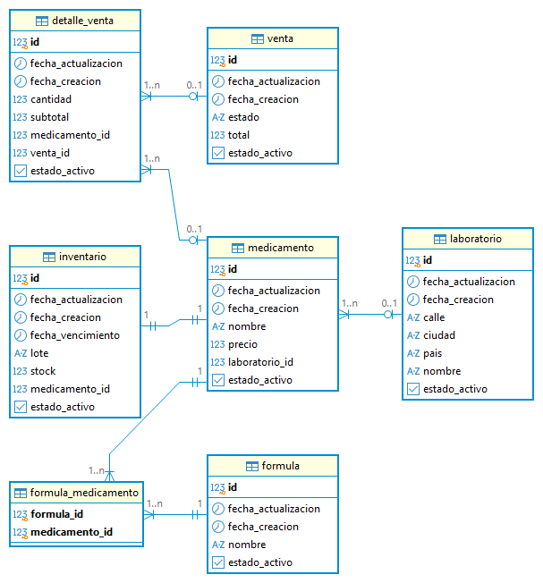

# Proyecto Integrador — Sistema de Gestión de Farmacia


## 📋 Resumen Ejecutivo

El presente proyecto corresponde al Proyecto Integrador desarrollado por
el equipo de trabajo para la construcción de una aplicación web
empresarial orientada a la gestión de información de un sistema de
farmacia.

La aplicación está desarrollada utilizando Java y Vaadin, tomando como
base el modelo entidad-relación definido previamente en el módulo de
Bases de Datos.

Durante el primer avance se establece la estructura inicial del proyecto,
el mapeo del modelo entidad-relación hacia clases POJO y la construcción
de la interfaz inicial utilizando Vaadin.

En esta etapa se prioriza la correcta representación de las entidades
del modelo mediante clases Java, respetando los nombres de las tablas,
atributos y tipos de datos definidos en el modelo.

---

## 🎯 Objetivos

### Objetivo general

Desarrollar una aplicación web empresarial utilizando Java y Vaadin para
la gestión de las entidades definidas en el modelo entidad-relación del
sistema de farmacia.

### Objetivos específicos

- Configurar la estructura base de una aplicación Java con Vaadin.
- Mapear las tablas del modelo entidad-relación hacia clases POJO.
- Respetar los nombres y tipos de datos definidos en el modelo.
- Implementar una interfaz inicial para visualizar y gestionar las
  diferentes entidades del sistema.
- Preparar la arquitectura del proyecto para las siguientes etapas de
  persistencia y operaciones CRUD.
- Mantener el código fuente organizado mediante Git y GitHub.

---

# 🏗️ Arquitectura del Proyecto

La aplicación se encuentra estructurada inicialmente utilizando una
arquitectura orientada a separar la interfaz de usuario y el modelo de
datos.

```text
                    ┌──────────────────────┐
                    │       Usuario        │
                    │      Navegador       │
                    └──────────┬───────────┘
                               │
                               ▼
                    ┌──────────────────────┐
                    │        Vaadin        │
                    │      MainView        │
                    └──────────┬───────────┘
                               │
                               ▼
                    ┌──────────────────────┐
                    │       Model          │
                    │       POJOs          │
                    └──────────┬───────────┘
                               │
                               ▼
                    ┌──────────────────────┐
                    │    Persistencia      │
                    │   JDBC / PostgreSQL  │
                    │   (siguiente etapa)  │
                    └──────────────────────┘
```

### Estado actual

En el Avance 1 se encuentran implementados principalmente:

- Estructura base de Vaadin.
- `MainView`.
- Clases POJO correspondientes al modelo.
- Interfaz inicial para las entidades.

La capa de persistencia mediante JDBC y la conexión con PostgreSQL
serán desarrolladas en las siguientes etapas del proyecto.

---

# 🗄️ Modelo de Datos

El proyecto se basa en el modelo entidad-relación correspondiente al
sistema de gestión de farmacia.

El modelo está compuesto por las siguientes tablas:

1. `detalle_venta`
2. `venta`
3. `inventario`
4. `medicamento`
5. `laboratorio`
6. `formula`
7. `formula_medicamento`

## 📌 Diagrama Entidad-Relación

El diagrama utilizado como base del proyecto se encuentra representado
a continuación:



> **Nota:** En este primer avance las relaciones correspondientes a las
> llaves foráneas no se implementan como asociaciones entre objetos.
> Los identificadores de dichas llaves se mantienen como atributos
> simples en las clases POJO.

---

# 🔄 Mapeo Relacional a Objetos

El mapeo realizado establece una correspondencia directa entre las tablas
del modelo y las clases Java.

| Tabla | Clase Java |
|---|---|
| `detalle_venta` | `DetalleVenta` |
| `venta` | `Venta` |
| `inventario` | `Inventario` |
| `medicamento` | `Medicamento` |
| `laboratorio` | `Laboratorio` |
| `formula` | `Formula` |
| `formula_medicamento` | `FormulaMedicamento` |

## Convenciones utilizadas

Las tablas mantienen su nombre original en la base de datos utilizando
snake_case.

Las clases Java utilizan PascalCase y los atributos utilizan camelCase.

Ejemplo:

```text
Tabla:
detalle_venta

Clase:
DetalleVenta

Atributo:
fecha_actualizacion

Atributo Java:
fechaActualizacion
```

---

# 📦 Entidades del Sistema

## DetalleVenta

Representa el detalle asociado a una venta.

| Atributo | Tipo Java |
|---|---|
| `id` | `Integer` |
| `fechaActualizacion` | `LocalDateTime` |
| `fechaCreacion` | `LocalDateTime` |
| `cantidad` | `Integer` |
| `subtotal` | `Integer` |
| `medicamentoId` | `Integer` |
| `ventaId` | `Integer` |
| `estadoActivo` | `Boolean` |

---

## Venta

Representa una venta realizada dentro del sistema.

| Atributo | Tipo Java |
|---|---|
| `id` | `Integer` |
| `fechaActualizacion` | `LocalDateTime` |
| `fechaCreacion` | `LocalDateTime` |
| `estado` | `String` |
| `total` | `Integer` |
| `estadoActivo` | `Boolean` |

---

## Inventario

Representa los registros de inventario de los medicamentos.

| Atributo | Tipo Java |
|---|---|
| `id` | `Integer` |
| `fechaActualizacion` | `LocalDateTime` |
| `fechaCreacion` | `LocalDateTime` |
| `fechaVencimiento` | `LocalDateTime` |
| `lote` | `String` |
| `stock` | `Integer` |
| `medicamentoId` | `Integer` |
| `estadoActivo` | `Boolean` |

---

## Medicamento

Representa los medicamentos disponibles en el sistema.

| Atributo | Tipo Java |
|---|---|
| `id` | `Integer` |
| `fechaActualizacion` | `LocalDateTime` |
| `fechaCreacion` | `LocalDateTime` |
| `nombre` | `String` |
| `laboratorioId` | `Integer` |
| `estadoActivo` | `Boolean` |

---

## Laboratorio

Representa los laboratorios asociados al sistema.

| Atributo | Tipo Java |
|---|---|
| `id` | `Integer` |
| `fechaActualizacion` | `LocalDateTime` |
| `fechaCreacion` | `LocalDateTime` |
| `calle` | `String` |
| `ciudad` | `String` |
| `pais` | `String` |
| `nombre` | `String` |
| `estadoActivo` | `Boolean` |

---

## Formula

Representa las fórmulas registradas en el sistema.

| Atributo | Tipo Java |
|---|---|
| `id` | `Integer` |
| `fechaActualizacion` | `LocalDateTime` |
| `fechaCreacion` | `LocalDateTime` |
| `nombre` | `String` |
| `estadoActivo` | `Boolean` |

---

## FormulaMedicamento

Representa la tabla intermedia entre fórmulas y medicamentos.

| Atributo | Tipo Java |
|---|---|
| `formulaId` | `Integer` |
| `medicamentoId` | `Integer` |

---

# 🧱 Clases POJO

Las entidades del modelo se implementan como clases POJO (Plain Old
Java Objects).

Cada clase contiene:

- Atributos privados.
- Constructor vacío.
- Constructor con todos los atributos.
- Métodos `getter`.
- Métodos `setter`.
- Método `toString()`.

No se utilizan anotaciones de Hibernate o JPA para realizar el mapeo
objeto-relacional en esta etapa.

---

# 🖥️ Interfaz de Usuario

La interfaz inicial se implementa mediante Vaadin utilizando una
`MainView`.

La interfaz permite visualizar las diferentes entidades mediante
secciones independientes:

```text
Proyecto Integrador
│
├── Detalle Venta
├── Venta
├── Inventario
├── Medicamento
├── Laboratorio
├── Fórmula
└── Fórmula Medicamento
```

Los formularios de la interfaz utilizan componentes de Vaadin para
representar los atributos correspondientes a cada entidad.

En esta primera etapa los controles de la interfaz corresponden a la
estructura visual inicial del proyecto. La persistencia real y las
operaciones CRUD serán implementadas posteriormente.

---

# 🛠️ Stack Tecnológico

| Tecnología | Versión / Uso |
|---|---|
| Java | 25 |
| Vaadin | 25.3.0 |
| Spring Boot | 4.1.1 |
| Maven | Maven Wrapper |
| PostgreSQL | Base de datos prevista |
| JDBC | Persistencia manual prevista |
| Git | Control de versiones |
| GitHub | Repositorio y colaboración |
| Visual Studio Code | Entorno de desarrollo |

---

# 📁 Estructura del Proyecto

```text
proyecto-integrador/
│
├── .gitignore
├── README.md
├── pom.xml
├── mvnw
├── mvnw.cmd
│
└── src/
    └── main/
        ├── java/
        │   └── com/
        │       └── example/
        │           ├── Application.java
        │           ├── MainView.java
        │           │
        │           └── model/
        │               ├── DetalleVenta.java
        │               ├── Venta.java
        │               ├── Inventario.java
        │               ├── Medicamento.java
        │               ├── Laboratorio.java
        │               ├── Formula.java
        │               └── FormulaMedicamento.java
        │
        └── resources/
```

---

# ⚙️ Guía de Configuración

## Requisitos

Para ejecutar el proyecto se requiere:

- Java 25 o una versión compatible con la configuración del proyecto.
- Visual Studio Code u otro IDE compatible con proyectos Java.
- Git.
- Conexión a Internet para descargar las dependencias Maven.

El proyecto incluye Maven Wrapper, por lo que no es necesario tener
Maven instalado globalmente.

## Clonar el repositorio

```bash
git clone URL_DEL_REPOSITORIO
```

Ingresar al directorio:

```bash
cd proyecto-integrador
```

## Ejecutar en Windows

```powershell
.\mvnw.cmd
```

También puede utilizarse:

```powershell
.\mvnw.cmd spring-boot:run
```

La aplicación estará disponible en:

```text
http://localhost:8080
```

> La conexión a PostgreSQL y las variables de entorno para la base de
> datos serán documentadas cuando se implemente la capa de persistencia.

---

# 🌿 Flujo de Trabajo con Git

El equipo utiliza Git y GitHub para controlar las versiones del
proyecto.

Se propone trabajar mediante ramas por funcionalidad:

```text
main
│
├── feature/modelo
├── feature/vaadin
└── feature/persistencia
```

Los cambios deben realizarse mediante commits descriptivos.

### Ejemplos

```bash
git add .
git commit -m "feat: crear modelo de entidades"
```

```bash
git commit -m "feat: implementar POJO DetalleVenta"
```

```bash
git commit -m "feat: actualizar MainView con entidades del sistema"
```

```bash
git commit -m "docs: agregar documentacion del modelo"
```

Los cambios desarrollados por los integrantes deben mantener una
trazabilidad clara en el repositorio.

---

# 👥 Equipo de Trabajo

| Integrante | Rol |
|---|---|
| **Jeisson** | Líder del equipo |
| **Juan José** | Integrante |
| **Sebastián** | Integrante |

## Responsabilidades

### Jeisson — Líder

- Coordinación general del proyecto.
- Configuración inicial del repositorio.
- Integración del proyecto.
- Desarrollo de entidades asignadas.
- Coordinación de la documentación.

### Juan José

- Desarrollo de las entidades asignadas.
- Implementación de clases POJO.
- Desarrollo de componentes de interfaz.
- Pruebas y documentación de sus aportes.

### Sebastián

- Desarrollo de las entidades asignadas.
- Implementación de clases POJO.
- Desarrollo de componentes de interfaz.
- Pruebas y documentación de sus aportes.

---

# 📌 Estado del Proyecto

## Avance 1 — Semana 12

### Completado

- [x] Repositorio GitHub.
- [x] Estructura base del proyecto Vaadin.
- [x] Configuración Maven.
- [x] Modelo de entidades.
- [x] Mapeo de tablas a clases POJO.
- [x] Constructores de las entidades.
- [x] Getters y setters.
- [x] Método `toString()`.
- [x] Interfaz inicial `MainView`.
- [x] Documentación inicial del modelo.

### Pendiente para siguientes etapas

- [ ] Configuración de PostgreSQL / Neon.
- [ ] Configuración JDBC.
- [ ] Capa DAO.
- [ ] Consultas SQL manuales.
- [ ] Operaciones Create.
- [ ] Operaciones Read.
- [ ] Operaciones Update.
- [ ] Operaciones Delete.
- [ ] Validaciones.
- [ ] Pruebas CRUD.
- [ ] Documentación final de despliegue.

---

# 📄 Licencia y Créditos

Este proyecto es desarrollado con fines académicos como parte del
Proyecto Integrador.

El modelo entidad-relación utilizado como base corresponde al diseño
realizado previamente en el módulo de Bases de Datos.

El proyecto utiliza tecnologías de código abierto como Java, Vaadin,
Spring Boot, Maven y PostgreSQL.

---

## 🚀 Próximos Pasos

El desarrollo continuará con la implementación de la capa de
persistencia manual utilizando JDBC y PostgreSQL.

La arquitectura objetivo será:

```text
Vaadin
   │
   ▼
Views
   │
   ▼
POJO
   │
   ▼
DAO / JDBC
   │
   ▼
PostgreSQL
```

Posteriormente se implementarán las operaciones CRUD para las entidades
del modelo.